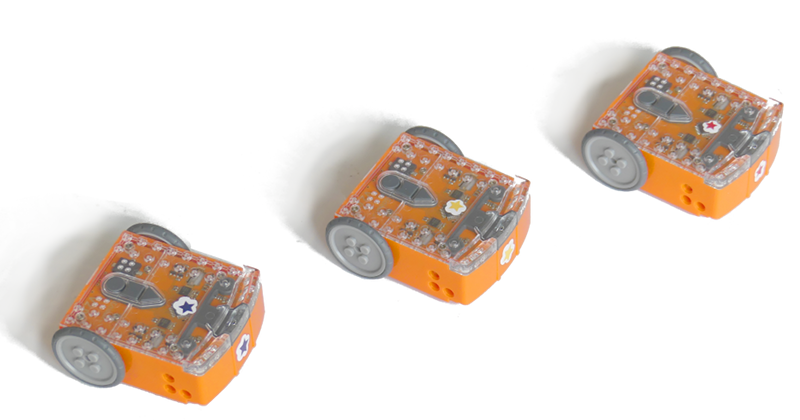

[← Zpět na rozcestník návodů](../index.md)

# Úlohy s roboty Edison
_píše Martin Javorek_

[Roboty Edison](http://meetedison.com/) lze programovat ve třech různých "jazycích". Nejjednodušší jsou [EdBlocks](https://www.edblocksapp.com/), o něco pokročilejší je pak [EdWare](https://edwareapp.com/) a pro nejvíce pokročilé programování existuje velmi osekaná podmnožina jazyka Python [EdPy](http://edpyapp.com/). Moje příklady jsou většinou v jazyce EdPy, protože jde o pokročilé úlohy a s jednoduššími rozhraními jsem čas neztrácel. 

Roboti jsou tak pěkným můstkem, jak děti z blokového programování pomalu převést právě např. do Pythonu.

## Tipy a triky
* [Jak si vypsat hodnotu, kterou ví jen robot Edison (pokus o debugging)](radar/debug.md)
* Další chytáky zjištěné při programování robotů

## Pokročilé úlohy
Úlohy s roboty obecně dělíme na dvě kategorie. Ta první je "WOW, to se hýbe" a druhá jsou složitější úlohy, kde se musí více přemýšlet. V kategorii WOW je dnes naprostá většina všech dostupných úloh, které jsou pro (libovolné) roboty dostupné. Pokusil jsem se tedy připravit nějaké pokročilejší úlohy, které mohou posloužit jako inspirace pro práci se staršími dětmi, které nad "WOW, to se hýbe" brzy krčí rameny.

* Mice rescue (zachraň myši)
* Štafeta
* Závory na železničním přejezdu
