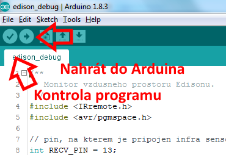

[← Zpět na rozcestník návodů pro roboty](../index.md)

# Jak si vypsat hodnotu, kterou ví jen robot Edison (pokus o debugging)

* obsah
{:toc}
{::options toc_levels="2..3" /}

Velmi brzy člověk při programování Edisonů dojde k tomu, že by potřeboval vědět, jakou hodnotu ukrývá která proměnná. Edison bohužel nemá displej a také nedisponuje obousměrnou komunikací s počítačem, tedy mu to nemá jak říci zpět. 

Zde si představíme 2 způsoby, jak na Edisonovi vyzvědět, o čem přemýšlí.

## Neumím psát, ale umím mluvit
První, co mě napadlo, byly základní výstupy Edisona: zvuk a světlo. Připadal jsem si trochu jako v [románu Marťan](https://cs.wikipedia.org/wiki/Mar%C5%A5an_(rom%C3%A1n)), ale i pomocí takto primitivních metod lze zjistit (alespoň přibližně), jakou hodnotu proměnná má.

Program, který nám vybliká a vypípá hodnotu načtenou ze sensoru pro sledování čáry:

[vypipej_barvu.py](vypipej_barvu.py)
``` python

```

Pokud je hodnota vyšší než 1000, pípne jednou. Následně zabliká stovky a zapípá desítky. Jednotky mi přišly v tuto chvíli nedůležité. Tento způsob komunikace s robotem nelze využít ve chvíli, kdy bliká, pípá v rámci jiné úlohy (nedopočítali bychom se) a také to není moc praktický způsob výpisu pro dynamické úlohy, kdy např. robot uhání po podlaze a my potřebujeme vidět, o čem přemýšlí. Ale lze s ním např. proměřit množství světla odráženého od podlahy a dále pak s danou hodnotou pracovat.

## Radar - monitor vzdušného prostoru
Edisoni se umí vzájemně domlouvat přes infračervené rozhraní (zkratka IR, jde o stejné rozhraní, jako používá napr. ovladač k TV). Poslat lze 1 bajt, tedy hodnotu od 0 do 255. Pokud bychom tedy postavili nějaký radar, který nám bude sledovat vzdušný prostor, dokážeme vidět na to, co si Edisoni povídají nebo jaké hodnoty mají jejich proměnné. 

Takový radar můžeme postavit relativně snadno např. s nějakým mikrokontrolerem typu Arduino.

### Foto


### Co budeme potřebovat
* Mikrokontroler typu Arduino (je asi úplně jedno, jaký typ to bude, zda [Uno, Nano, Micro](https://www.arduino.cc/en/Main/Boards)) ale může to být samozřejmě i [NodeMCU](http://www.nodemcu.com/) či cokoliv podobného ([Aliexpress](https://www.aliexpress.com/wholesale?ltype=wholesale&d=y&origin=y&blanktest=0&jump=afs&SearchText=arduino+uno&tc=af&initiative_id=SB_20180308074135&isViewCP=y&catId=0))
* IrDa čidlo, např. VS 1838B ([Aliexpress](https://www.aliexpress.com/wholesale?ltype=wholesale&d=y&origin=y&blanktest=0&jump=afs&SearchText=VS1838B&tc=af&initiative_id=SB_20180308074253&isViewCP=y&catId=0), [specifikace](IR-Receiver-AX-1838HS.pdf))
* nepájivé pole ([Aliexpress](https://www.aliexpress.com/wholesale?ltype=wholesale&d=y&origin=y&blanktest=0&jump=afs&SearchText=breadboard&tc=af&initiative_id=SB_20180308074314&isViewCP=y&catId=0))
* 3 vodiče ([Aliexpress](https://www.aliexpress.com/wholesale?ltype=wholesale&d=y&origin=y&blanktest=0&jump=afs&SearchText=jumper+wires+male&tc=af&initiative_id=SB_20180308074338&isViewCP=y&catId=0))
* USB kabel pro připojení mikrokontroleru k počítači (může být std. A-B, nebo mikro nebo jiný dle potřeby)
* Počítač s Windows, Linux či Mac OS
* [Arduino IDE](https://www.arduino.cc/en/Main/Software)

### Zapojení
Zapojení je velmi jednoduché. Nicméně pozor na to, aby nožičky infra sensoru byly zapojeny správně, jelikož např. při přehození polarity napájení sensor smrdí a nefunguje :smirk:.


[edison_debug.fzz](edison_debug.fzz)

[](edison_debug_bb.png)

### Program pro radar
Nejdříve jsem se mylně domníval, že Edisoni budou posílat do éteru přímo danou hodnotu. Když jsem zjistil, že na 1 bajt vstupu mám vždy 4 bajty na výstupu, pokoušel jsem se alespoň rozklíčovat operaci, kterou Edison s hodnotou provede, než ji pošle do éteru. Ale ani na to se mi nepodařilo přijít. 

Nakonec jsem rezignoval a všech 256 získaných hodnot vložil natvrdo do lookup table kódu Arduina. 256 × 4 bajty = 1024 bajtů, pokud využijeme flash memory, nezabíráme si ani drahocenou statickou paměť ([které má Uno jen 2&nbsp;KB](https://www.arduino.cc/en/Products/Compare)) a funguje to také. Chceme programovat Edisony, ne strávit čas psaním elegantních debuggerů. 

> _Pro zájemce, kteří by přeci jen moc chtěli bádat, zde je k nahlédnutí [kompletní překladová tabulka](edison_infra.txt), kterou získáte, když v mém kódu Arduina pustíte metodu `printCodes()` a necháte Edisona posílat přes infra čísla 0 - 255 s nějakou časovou prodlevou._

Program umí několik věcí, ale v základu je nastaven tak, že monitoruje vzdušný prostor a vypisuje hodnoty na sériovou konzoli. Nicméně obsahuje i části, které jsem potřeboval na to, abych zmapoval všechny kódy, kterým se robot Edison s jinými roboty domlouvá.

[edison_debug.ino](edison_debug.ino)
``` c++

```

### Jak program nahrát do Arduina
Protože sepisuji s našimi dětmi [jednoduché prográmky pro Arduino](http://arduino.zausima.cz/), neuvědomil jsem si nejdříve, že každý programátor Edisonů nemusí umět naprogramovat Arduino. Proto tady ve zkratce popíšu i to, jak dostat program do Arduina, když už jste došli až sem.

Hrát si s Arduinem lze na všech běžných platformách jako je Windows, Linux či Mac. Bohužel na Macu jsem to nikdy nezkoušel, níže uvádím vše pro Windows či Linux.

#### 1. Prerekvizity
Na Linuxu potřebujeme oprávnění pro práci se seriovým portem. Uživatel musí být členem skupiny `dialout`.

Takto zjistíme, v jakých jsme skupinách
``` bash
$ groups
```
Takto uživatele (i sebe) přidáme do skupiny `dialout`.
``` bash
$ sudo usermod -aG dialout <user>
```
Dále potřebujeme mít nainstalováno [Arduino IDE](https://www.arduino.cc/en/Main/Software).

#### 2. Připojíme Arduino k počítači
USB konektor z Arduina připojíme k libovolnému USB konektoru počítače. Nemáte-li vhodný konektor, bude třeba najít vhodný kabel.

#### 3. Nastavíme desku
V Arduino IDE nastavíme správnou desku podle toho, jaký jsme použili mikrokontroler.


#### 4. Nastavíme port
Aby Arduino IDE vědělo, na jakém USB portu jsme připojili Arduino, které má programovat, musíme mu to prozradit. IDE se samo pokouší detekovat, kde Arduino je, ale je minimálně dobré to zkontrolovat a nebo správně přenastavit.


> **Jak poznám, na jakém portu je Arduino připojeno?**
>
>**Windows** (nemám bohužel českou verzi)
>* Control panels/Device manager
>* Pod záložkou Ports (COM & LPT) najít, kde ho máme
>
>
>**Linux**
>``` bash
>ls -l /dev/tty*
>```
>nebo ještě lépe
>``` bash
>dmesg | tail
>```

#### 5. Nainstalovat knihovnu pro práci s IR
Program pro Arduino využívá knihovnu pro práci s IR.


Do vyhledávacího pole vypíšeme `irremote` a nainstalujeme knihovnu `IRremote` v její poslední verzi.


#### 6. Nahrajeme program do Arduina
* Otevřeme v Arduino IDE soubor [edison_debug.ino](edison_debug.ino)
* fajfkou spustíme kontrolu kódu
* šipkou nahrajeme program do Arduina

Nahrávání chvíli trvá, po tu dobu obvykle poblikávají LEDky na Arduinu.




### Hlídáme vzdušný prostor
Protože budeme potřebovat monitorovat výstup Arduina, musíme ho pro puštění připojit k počítači (nemůžeme ho provozovat např. přes baterii).

1. připojit arduino k počítači
1. nastavit správnou desku
1. nastavit správný port
1. pustit monitor seriové konzole


### Program pro Edisona
Protože Edison dovoluje poslat pouze hodnotu 0 - 255, ale vnitřně pracuje se 16 bitovými proměnnými, můžeme si napsat metodu, která nám pošle oba bajty dvoubajtové proměnné a radar hodnotu složí. Bylo by fajn pak ale sekvenci uvést nějakým kódem. Za ten jsem vybral hodnotu `0×FF` (255). Chytí-li tedy radar hodnotu `0×FF`, očekává pak ještě další 2 hodnoty a pokusí se je přeložit do dvoubajtového čísla. 

>Tento postup nebude dobře fungovat, pokud by hovořili dva roboti najednou. Tam bych se pokud možno omezil na jednobajtové hodnoty, i tak je někdy problém rozpoznat, který Edison říká co :smiley:.

[edison_debug.py](edison_debug.py)
``` python

```

Výstup na radaru (monitoru seriové konzole) pak vypadá nějak takto:


### Poznatky z praxe

#### Pozor na přeslechy

Edisoni svítí infračervěně velmi daleko, komunikace byla navržena tak, [aby bylo možné si "povídat" přes celou učebnu](https://meetedison.com/forum/edpy-programming/ir-data-in-edpy/), takže dosah je klidně 4 a více metrů. Nicméně jde o světlo (byť pro lidi neviditelné), dochází k odrazům a může tak dojít i k "přeslechům", pokud je např. robot zády k čidlu. Pak Arduino program vypisuje, že hodnotě neporozuměl a neumí ji přeložit.

#### Pozor na příliš mnoho světla

Infračervené světlo je (jak název napovídá) světlo. Sice ho nevidíme, ale je to světlo a když svítíme více zdroji světla (více roboty najednou), je světla moc :smiley:. To znamená, že můžeme zahlušit kompletně vzdušný prostor hromadou infračerveného světla a nejen náš radar, ale ani roboti vzájemně si nebudou rozumět.

#### Pozor na jiná IR zařízení

Souvisí to trochu s předchozím upozorněním, pokud svítíme infračerveně dalším zdrojem, může docházet k přeslechům. Ale tím zdrojem nemusí nutně být robot Edison, může to být klidně ovladač TV, který někdo v místnosti používá, nebo i [ovladač vlaku](TODO link), který je součástí řešené úlohy... :smiley:

#### Pozor na příliš velkou rychlost

Přišel jsem na to, že i Edison má své limity, a pokud ho necháme posílat přes infra kódy příliš rychle, nezvládá to a posílá nesmysly (obvykle hodnotu `0×FF`, tedy 255). Experimentálně jsem přišel na to, že je potřeba mezi po sobě jdoucími odeslanými kódy z Edisona dát prodlevu alespoň 10&nbsp;ms, lépe více. Tohle by se mi bez radaru zjišťovalo opravdu těžko!

``` python
Ed.SendIRData(1)
# bez teto prodlevy nam neprijde 1 a 2, ale 1 a nesmyslnych 255
Ed.TimeWait(10, Ed.TIME_MILLISECONDS) 
Ed.SendIRData(2)
```
