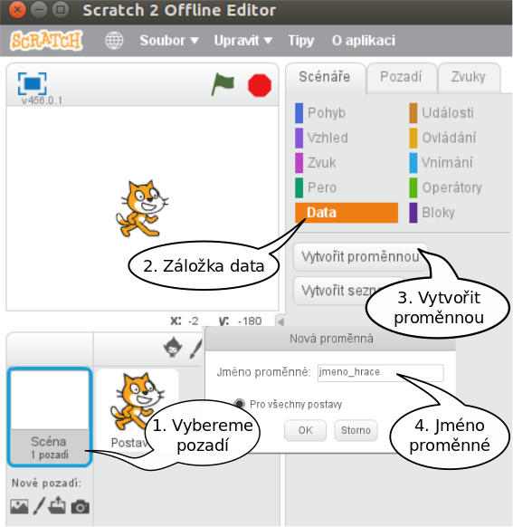
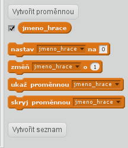
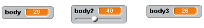
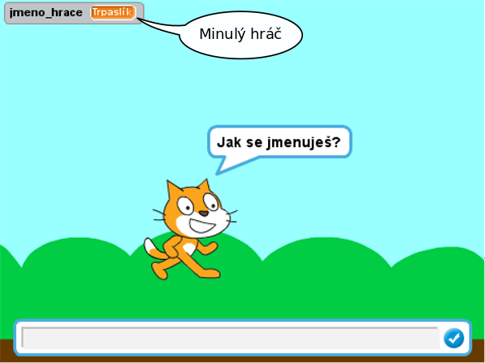

# Proměnné

***

### Co se naučíme:
* co je proměnná
* vytvořit proměnnou
* zobrazit a skrýt proměnnou na scéně
* nastavit proměnné hodnotu
* rozlišovat mezi `proměnnou pro všechny postavy` a `jen pro tuto postavu`

***

## Co je proměnná
Představte si, že chceme vytvořit program, který se hráče zeptá před hrou na jméno, to si uloží a na konci hry mu zobrazí jeho jeho jméno a počet získaných bodů.

K ukládání informací, jako je jméno, počet bodů, poloha postavy na scéně, počet životů …, slouží **proměnné**. 
Proměnnou si můžeme představit jako takový šuplík, který si označíme jménem. My si ho pojmenujeme `jmeno_hrace`.  Do šuplíku vložíme konkrétní jméno, třeba *Karel*. Až budeme jméno hráče potřebovat, vytáhneme ho ze šuplíku s názvem `jmeno_hrace`.

V programování říkáme takovému šuplíku **PROMĚNNÁ**, to, jak pojmenujeme šuplík je **JMÉNO PROMĚNNÉ**, a to, co je uvnitř šuplíku, je **HODNOTA PROMĚNNÉ**.
## Vytvoření proměnné

Ve Scratchi máme pro proměnné a práci s nimi oranžovou záložku 

 Nyní si vytvoříme naši proměnnou `jmeno_hrace`:



 Společně s první proměnnou se nám vygenerují i příkazy, kterými lze proměnnou nastavovat:



## Vzhled proměnných
Zobrazování/skrývání proměnné na scéně se dělá ručně pomocí checkboxu u proměnné, programově pak pomocí příkazů `ukaž proměnnou` a `skryj proměnnou`.

Vzhled proměnné na scéně se nastavuje dvojklikem (nebo levým tlačítkem myši) na hodnotu proměnné na scéně:



## Nastavení hodnoty proměnné
Proměnné ve Scratchi nejsou typové, vkládat do nich můžeme jak text, tak čísla.

Nastavení hodnoty proměnné a její čtení:
```blocks
po kliknutí na @greenFlag
ptej se [Jak se jmenuješ] a čekej
nastav [jmeno_hrace v] na(odpověď)
řekni(jmeno_hrace)
```

```blocks
po kliknutí na @greenFlag
ptej se [Jak se jmenuješ] a čekej
nastav [jmeno_hrace v] na(odpověď)
ptej se (spoj(jmeno_hrace )[, to je pěkné jméno. A jak ti mám říkat?]) a čekej
nastav [osloveni v] na(odpověď)
řekni(spoj([Ahoj ](osloveni))
```
Pokud budeme program spouštět opakovaně, jistě si všimneme, že po startu programu zůstává v proměnné nastavena její minulá hodnota:


Na toto chování (mimochodem, stejně funguje i seznam) je třeba si dát pozor a v případě potřeby proměnné po startu vyčistit:
```blocks
po kliknutí na @greenFlag
nastav [jmeno_hrace v] na []
nastav [body] na (0)
```
<p>You can quote text with a po kliknutí na @greenFlag

</p>

<details><summary>Zkušenosti s výukou</summary><p markdown="1">
Doporučuji ujistit se, že děti vnímají rozdíl mezi  <code class="language-blocks">nastav [ v] na []</code> a <code class="language-blocks">změň [ v] o ()</code>. 
Zároveň je vhodné upozornit, že pokud chceme zmenšovat  hodnotu proměnné (např. ubírání životů), je třeba do    argumentu funkce dát záporné číslo. 
</p></details>

 
> Tipy na objevování
>1. Co sestane po spuštění? 
>```blocks
>po kliknutí na @greenFlag
>nastav [jmeno_hrace v] na [Karel]
>změň [jmeno_hrace v] o (1)
>```
> 2. Co bude v proměnné `jmeno_hrace`?
>```blocks
>po kliknutí na @greenFlag
>ptej se [Jak se jmenuješ?] a čekej
>ptej se [Kolik je ti roků?] a čekej
>nastav [jmeno_hrace v] na(odpověď)
>```


## Proměnné `Pro všechny postavy` a `Jen pro tuto postavu`
Rozlišujeme, zda proměnná, kterou chceme vytvořit, má smysl pro program jako celek, nebo zda se jedná o vlastnost nebo informaci týkající se pouze některé z postav.
Pokud se rozhodneme, že proměnná nemá vztah jen k jedné z postav, můžeme ji vytvářet a mít při tom vybranou jakoukoli postavu nebo i pozadí. Volbou `Pro všechny postavy`zajistíme, že proměnná nebude spojována s žádnou postavou, všechny postavy i pozadí na ni "uvidí" a budou ji moci nastavovat. Takovým příkladem je třeba jméno hráče, počet bodů, zbyvající čas hry... 

Pokud je možno proměnnou prohlásit za vlastnost postavy nebo je to pomocná proměnná, kterou využívá jen jedna postava, je vhodné před jejím vytvořením vybrat odpovídající postavu a zaškrtnout možnost `Jen pro tuto postavu`.
Takovou proměnnou bude moci používat jen postava, ve které byla proměnná vytvořena. Ostatní ji nastavovat nemohou. Její hodnotu mohou získat pomocí funkce v záložce Vnímání, kde vyberou správnou postavu a k ní odpovídající název proměnné.

 


>**Zkušenosti s výukou:**
Jelikož proměnné potřebujeme už od prvních prográmků, většinou právě na počítání bodů nebo životů, ze začátku dětem říkám bez vysvětlování, ať používají volbu `Pro všechny postavy`. `Jen pro tuto postavu` začínáme výrazně využívat až se zapojením klonů.(TADY BUDE LINK)
Nevýhodou tohoto postupu je, že si zvyknou bezmyšlenkovitě používat globální proměnné a je těžké je na pak na ty lokální přesvědčit. "Funguje to přece i tak.."