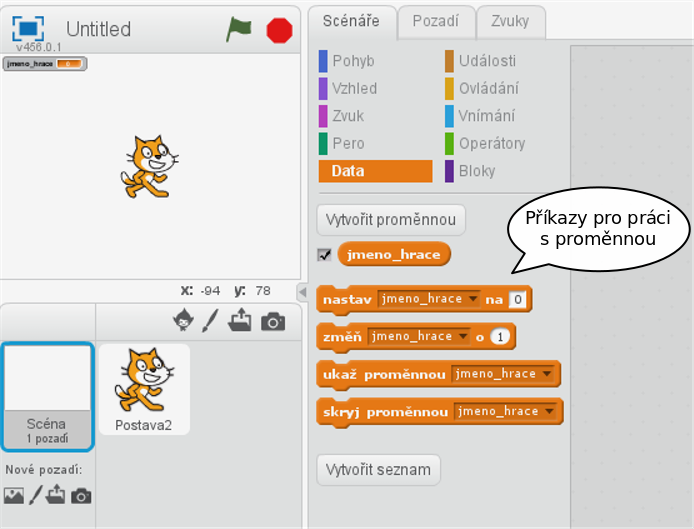
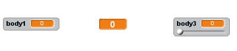
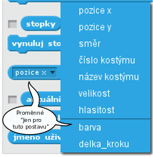

# Proměnné

***

### Co se naučíme:
* co je proměnná
* vytvořit proměnnou
* zobrazit a skrýt proměnnou na scéně
* nastavit proměnné hodnotu
* rozlišovat mezi `proměnnou pro všechny postavy` a `jen pro tuto postavu`

***

## Co je proměnná
Představte si, že chceme vytvořit program, který se hráče zeptá před hrou na jméno, to si uloží a na konci hry mu zobrazí jeho jeho jméno a počet získaných bodů.

K ukládání informací, jako je jméno, počet bodů, poloha postavy na scéně, počet životů …, slouží **proměnné**. 
Proměnnou si můžeme představit jako takový šuplík, který si označíme jménem. My si ho pojmenujeme <sb>(jmeno_hrace)</sb>.  Do šuplíku vložíme konkrétní jméno, třeba *Karel*. Až budeme jméno hráče potřebovat, vytáhneme ho ze šuplíku s názvem <sb>(jmeno_hrace)</sb>.

V programování říkáme takovému šuplíku **PROMĚNNÁ**, to, jak pojmenujeme šuplík je **JMÉNO PROMĚNNÉ**, a to, co je uvnitř šuplíku, je **HODNOTA PROMĚNNÉ**.
## Vytvoření proměnné

Ve Scratchi máme pro proměnné a práci s nimi oranžovou záložku 

 Nyní si vytvoříme naši proměnnou <sb>(jmeno_hrace)</sb>:


 Společně s první proměnnou se nám vygenerují i příkazy, kterými lze proměnnou nastavovat:



## Vzhled proměnných
Zobrazování/skrývání proměnné na scéně se dělá ručně pomocí checkboxu u proměnné, programově pak pomocí příkazů <sb>show variable [ v]</sb> a <sb>hide variable[ v]</sb>.

Proměnnou lze dodatečně přejmenovat. Jméno se změní na všech místech, kde je proměnná použita.


Vzhled proměnné na scéně se nastavuje dvojklikem (nebo pravým tlačítkem myši) na hodnotu proměnné **na scéně**:



## Nastavení hodnoty proměnné
Proměnné ve Scratchi nejsou typové, vkládat do nich můžeme jak text, tak čísla.

Nastavení hodnoty proměnné a její čtení:
```blocks
when @greenFlag clicked
ask [Jak se jmenuješ] and wait
set [jmeno_hrace v] to(odpověď)
say(jmeno_hrace)
```
nebo např.:

```blocks
when @greenFlag clicked
ask [Jak se jmenuješ?] and wait
set [jmeno_hrace v] to(odpověď)
ask (join(jmeno_hrace )[, to je pěkné jméno. A jak ti mám říkat?]) and wait
set [osloveni v] to(odpověď)
say(join[Ahoj ](osloveni))
```
Pokud budeme program spouštět opakovaně, jistě si všimneme, že po startu programu zůstává v proměnné nastavena její minulá hodnota:


Na toto chování (mimochodem, stejně funguje i seznam) je třeba si dát pozor a v případě potřeby proměnné po startu vyčistit:
```blocks
when @greenFlag clicked
set [jmeno_hrace v] to []
set [body v] to (0)
```
 
> ### Tipy na objevování:
>> **Co se stane po spuštění?**
>>```blocks
>>when @greenFlag clicked
>>set [jmeno_hrace v] to [Karel]
>>change [jmeno_hrace v] by (1)
>>```  
>><details><summary>Řešení</summary><p markdown="1">
>>Nastane chyba, v proměnné se objeví "NaN" (not a number)
>></p></details>
>
>> **Co bude v proměnné <sb>(jmeno_hrace)</sb>?**
>>```blocks
>>when @greenFlag clicked
>>ask [Jak se jmenuješ?] and wait
>>ask [Kolik je ti roků?] and wait
>>set [jmeno_hrace v] to(odpověď)
>>```
>><details><summary>Řešení</summary><p markdown="1">
>>V proměnné <sb>(jmeno_hrace)</sb> bude jeho věk
>></p></details>
>
>>**Uměli byste prohodit hodnoty dvou proměnných?** 
>>
>><details><summary>Řešení</summary><p markdown="1">
>>Měníme hodnotu proměnné <sb>(a)</sb> a <sb>(b)</sb> za pomoci proměnné <sb>(pom)</sb>.
>>
>><code class="language-blocks">
>>set [pom v] to(a)
>>set [a v] to(b)
>>set [b v] to(pom)
>></code>
>></p>
>></details>  
>   

## Zkušenosti s výukou
Doporučuji ujistit se, že děti vnímají rozdíl mezi  <sb>set [ v] to []</sb> a <sb>change [ v] by ()</sb>. 

Zároveň je vhodné upozornit, že pokud chceme zmenšovat  hodnotu proměnné (např. ubírání životů), je třeba do    argumentu funkce dát záporné číslo. <sb>change[pocet_zivotu] by (-1)</sb>

## Proměnné `Pro všechny postavy` a `Jen pro tuto postavu`
Rozlišujeme, zda proměnná, kterou chceme vytvořit, má smysl pro program jako celek, nebo zda se jedná o vlastnost nebo informaci týkající se pouze některé z postav.
Pokud se rozhodneme, že proměnná nemá vztah jen k jedné z postav, můžeme ji vytvářet a mít při tom vybranou jakoukoli postavu nebo i pozadí. Volbou `Pro všechny postavy`zajistíme, že proměnná nebude spojována s žádnou postavou, všechny postavy i pozadí na ni "uvidí" a budou ji moci nastavovat. Takovým příkladem je třeba jméno hráče, počet bodů, zbyvající čas hry... 

Pokud je možno proměnnou prohlásit za vlastnost postavy nebo je to pomocná proměnná, kterou využívá jen jedna postava, je vhodné před jejím vytvořením vybrat odpovídající postavu a zaškrtnout možnost `Jen pro tuto postavu`.
Takovou proměnnou bude moci používat jen postava, ve které byla proměnná vytvořena. Ostatní ji nastavovat nemohou. Její hodnotu mohou získat pomocí funkce v záložce Vnímání, kde vyberou správnou postavu a k ní odpovídající název proměnné.

 


>**Zkušenosti s výukou:**
Jelikož proměnné potřebujeme už od prvních prográmků, většinou právě na počítání bodů nebo životů, ze začátku dětem říkám bez vysvětlování, ať používají volbu `Pro všechny postavy`. `Jen pro tuto postavu` začínáme výrazně využívat až se zapojením klonů.(TADY BUDE LINK)
Nevýhodou tohoto postupu je, že si zvyknou bezmyšlenkovitě používat globální proměnné a je těžké je na pak na ty lokální přesvědčit. "Funguje to přece i tak.."