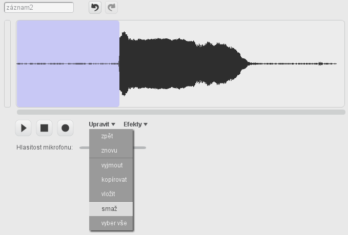
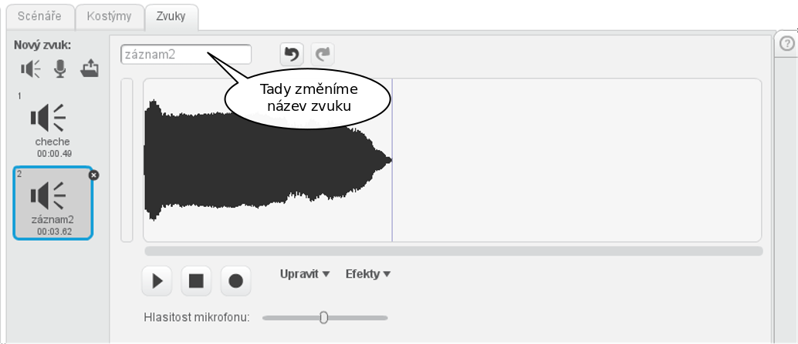

# Hmyzík

---
### Co se naučíme:

* Hlavně se naučíme používat <sb>opakuj dokola</sb>
* Příkazy <sb>jdi na [náhodná pozice v]</sb>, <sb>když narazíš na okraj, odraž se</sb>

---

### Co bychom už měli umět:

* Orientovat se ve Scratch editoru
* Používat spouštěcí události <sb>po kliknutí na mě</sb>, <sb>po stisku klávesy [ mezera v]</sb>, <sb>po kliknutí na @greenFlag</sb> 
* Přidat zvuk
* Měnit kostým

---

Cílem dnešního projektu je vyrobit hru, kde se po obrazovce sem a tam prohání nějaká postavička, po kliknutí na ni vydá zvuk a skočí jinam:


<iframe allowtransparency="true" width="485" height="402" src="//scratch.mit.edu/projects/embed/211925128/?autostart=false" frameborder="0" allowfullscreen></iframe>
[Program na stránkách scratch.mit.edu](https://scratch.mit.edu/projects/211925128/)

<div class="poznamka" markdown="1">
**Problém si rozdělímě na několik menších úkolů.** To je jedno ze základních informatických mouder. Pokud vám přijde problém moc složitý, rozdělte ho na několik drobných úkolů, které vyřešit už bude hračka.
</div>

Na scéně se má prohánět postavička, po kliknutí kvíknout a skočit jinam. To si přímo koleduje o rozdělení na dva úkoly:
## 1. naučit postavičku prohánět se po scéně
## 2. po kliknutí kvíknout a skočit jinam

Jelikož druhý úkol vypadá jednoduše a nám už známě, začneme s ním.

## Po kliknutí, kvíknout a skočit jinam

Hloubavci by mohli namítnout, že i tenhle problém se dá dělit...

Nejprve si vyberte postavičku, která se bude po scéně pohybovat. Mel by to být nějaký pták, motýl, moucha, zvíře.. Zkrátka něco, co může mávat křídly nebo packama a po zmáčknutí vydávat zvuky.

Zopakujeme si, jak přidat postavě zvuk:
**Vybereme postavu, které chceme přidávat zvuk**, vlezeme do záložky *Zvuky* a pomocí ikon  vyberme buď zvuk už hotový z knihovny, nebo si vytvoříme vlastní. 

<div class="poznamka" markdown="1"><b>Poznámka:</b>
Při nahrávání vlastního zvuku bude pravděpodobně vhodné zvuk oříznout - ustřihnout ticho na začátku a ticho na konci. To se dělá tak, že označíte v editoru oblast, kterou byste chtěli smazat a v nabídce *Upravit* vyberete možnost *smaž*.



Zkuste si i jiné úpravy a efekty. Tu část zvuku, kterou chcete upravovat, musíte nejprve označit mýší.

**Zvuk, který jste vytvořili si smysluplně pojmenujte tak, ať víte o který zvuk jde. Předejdete tak mnoha chybám a zdržením.**



</div>


Zvuk přidaný postavě už můžeme použít v programu:  <sb>přehraj zvuk [cheche v] </sb> .

Událost která spustí kód bude <sb>po kliknutí na mě </sb>.

Zbývá už jen skákání na náhodné místo na scéně. Na to má Scratch už pro nás připravený příkaz. Je ale důmyslně schovaný očím nezasveceného pozorovatele. Najdete ho v záložce , ale pod příkazem <sb>jdi na [ukazatel myši v]</sb>. Vyberte tento příkaz, jen ho pomocí čerého trojúhelníčku vpravo přeměňte na <sb>jdi na [náhodná pozice v]</sb>. 

Máme vše co potřebujeme a výsledek bude vypadat takto:
``` blocks
po kliknutí na mě
přehraj zvuk [cheche v]
jdi na [náhodná pozice v]
```

Program si teď můžete ozkoušet.

## Naučit postavičku běhat sem a tam po scéně

Otázka zní:"Jak naučit postavičku, aby běhala bez kláves sama?"

Určitě bychom už uměli vytvořit program, který po spuštění posune postavu o několik kroků:
``` blocks
po kliknutí na @greenFlag
posuň se o (10) kroků
```
Ale deset kroků nám nestačí, pro začátek bychom chtěli, aby postava došla alespoň ke kraji scény. Co takhle?
``` blocks
po kliknutí na @greenFlag
posuň se o (10) kroků
posuň se o (10) kroků
posuň se o (10) kroků
posuň se o (10) kroků
posuň se o (10) kroků
posuň se o (10) kroků
```

Je to lepší, ale postava je jen o pár kroků dál a programátory už bolí ruka. 

Abychom nemuseli pořád dokola opisovat to samé, existuje v programovacích jazycích příkaz `opakuj`. Ve Scratchi vypadá takto <sb>opakuj dokola</sb> nebo třeba tak <sb>opakuj () krát</sb>. Najdeme je v záložce .    
Všechno, co napíšeme dovnitř do podkovy se bude opakovat. Pokud použijeme první příkaz, bude se opakovat do nekonečna, pokud druhý, vše uvnitř podkovy se zopakuje tolikrát, kolikrát nastavíme v argumentu příkazu.

<div class="poznamka" markdown="1"><b>Poznámka:</b> Podrobnější nápady, jak trénovat s dětmi opakování s počítačem, ale hlavně bez najdete [zde](opakovani/opakovani.html)
</div>

Protože pohybovat se chceme po scéně stále, použijeme <sb>opakuj dokola</sb>:
``` blocks
po kliknutí na @greenFlag
opakuj dokola
posuň se o (10) kroků
```
<div class="poznamka" markdown="1"><b>Poznámka:</b> Ti rychlejší z vás už určitě stihli program spustit a postavička jim během mrknutí oka zmizela někam za scénu. Vytáhnout jí zpátky dá někdy zabrat. 
Zastavte program, v záložce  najdete příkaz <sb>skoč na pozici x: () y: ()</sb>. Příkaz nastavte na  <sb>skoč na pozici x: (0) y: (0)</sb> a dvakrát na něj poklepejte myší. Postava se vám vrátí doprostřed scény.
</div>

Abychom byli spokojení, hodilo by se, aby postava po spuštění programu vylétala vždy ze stejného místa. To zajistí jedno <sb>skoč na pozici x: (0) y: (0)</sb> na začátku programu.    
Zbývá už jen zajistit, že když postava dojede ke kraji scény, otočí se a jede/letí zpět. I na to se pamatovalo a ve Scratchi na to máme příkaz <sb>když narazíš na okraj, odraž se</sb>

Výsledek:

``` blocks
po kliknutí na @greenFlag
skoč na pozici x: (0) y: (0)
opakuj dokola
posuň se o (10) kroků
když narazíš na okraj, odraž se
```
<div class="poznamka" markdown="1"><b>Úkoly:</b></br>
:bulb: Spusťte program. Upravte ho tak, aby se postava, která běhá/létá po obrazovce nepohybovala hlavou dolů

:bulb: Upravte si rychlost postavy podle vašich představ

:bulb: Přidejte animaci postavy (mávání křídel, pohyb nohou...) Použijte k tomu příkaz <sb>další kostým</sb> a <sb>čekej()sekund</sb>

Pokud se nedaří, nakounkěte do [ukázkového programu](https://scratch.mit.edu/projects/211925128/)

</div>

