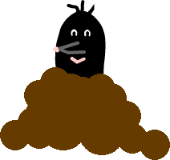

# Krtek


### Co se naučíme:

* Naučíme se, k čemu se nám hodí bloky
* Příkazy <sb>go to [náhodná pozice v]</sb>
* Namalovat si vlastní animaci
* Pracovat s <sb>stamp</sb> a <sb>clear</sb>

---

### Co bychom už měli umět:

* Orientovat se ve Scratch editoru
* Používat spouštěcí události <sb>when this sprite clicked</sb>, <sb>when @greenFlag clicked</sb> 
* Měnit kostým

---
V tomto projektu chceme naprogramovat krtka, který postupně vylézá ze země. Když na něj klikneme, schová se a začne se klubat jinde. Krtinec po něm zůstane.

<iframe allowtransparency="true" width="485" height="402" src="//scratch.mit.edu/projects/embed/212009089/?autostart=false" frameborder="0" allowfullscreen></iframe>

[Program na stránkách scratch.mit.edu](https://scratch.mit.edu/projects/2120090890)   

1. Namalujeme si vlastní pozadí Scény. 
2. Namalujeme si několik kostýmů, z kterých pak vytvoříme animaci klubajícího se krtka.
3. Krtkem skočíme na náhodné místo a necháme ho vylézt ze země
4. Po kliknutí skočí krtek jinam a opět vyleze ze země ven 
6. Doprogramujeme "otiskávání hromádek" pomocí příkazu <sb>stamp</sb> 
7. Po spuštění programu musíme smazat krtince z minula příkazem <sb>clear</sb>  


## 1. Pozadí scény

Namalujeme v editoru nějaký pěkný trávník nebo záhonek, který bude krtek moci rozrýt. 

## 2. Malování kostýmů, animace

Rostoucí krtinec vyrobíme alespoň ze tří kostýmů.    
Velice důležité je, aby měly všechny kostýmy střed na stejném místě. To zajistíme tak, že nový kostým vždy zkopírujeme z předcházejícího kostýmu a poté domalujeme.

            


## 3. Krtek leze ze země
Střídáním kostýmů vytvoříme animaci. Na náhodné místo krtka umístíme příkazem <sb>go to [náhodná pozice v]</sb>

``` blocks
    when @greenFlag clicked
    go to [náhodná pozice v]
    switch costume to [malý]
    wait (0.2) secs
    switch costume to [větší]
    wait (0.2) secs
    switch costume to [velký]

```
## 4. Po kliknutí skočí krtek jinam a tam vyleze
``` blocks
    when this sprite clicked
    go to [náhodná pozice v]
    switch costume to [malý]
    wait (0.2) secs
    switch costume to [větší]
    wait (0.2) secs
    switch costume to [velký]

```

Když teď koukneme na náš kód, vidíme, že jsou tam dva identické scénáře, které se liší pouze událostí, která je spouští. Jedno z programátorských pravidel říká, že 