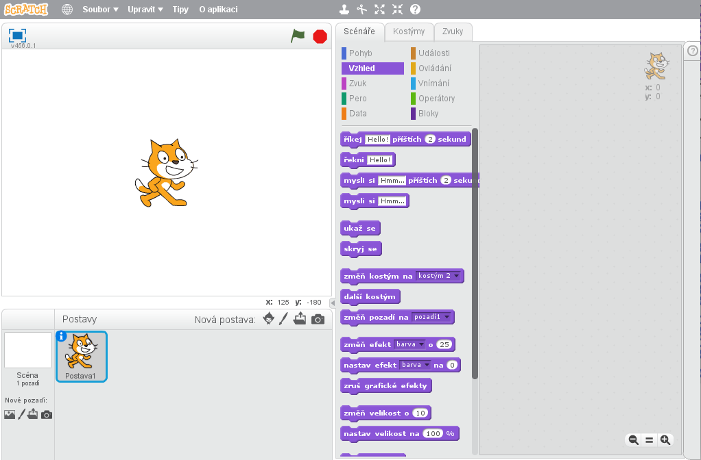
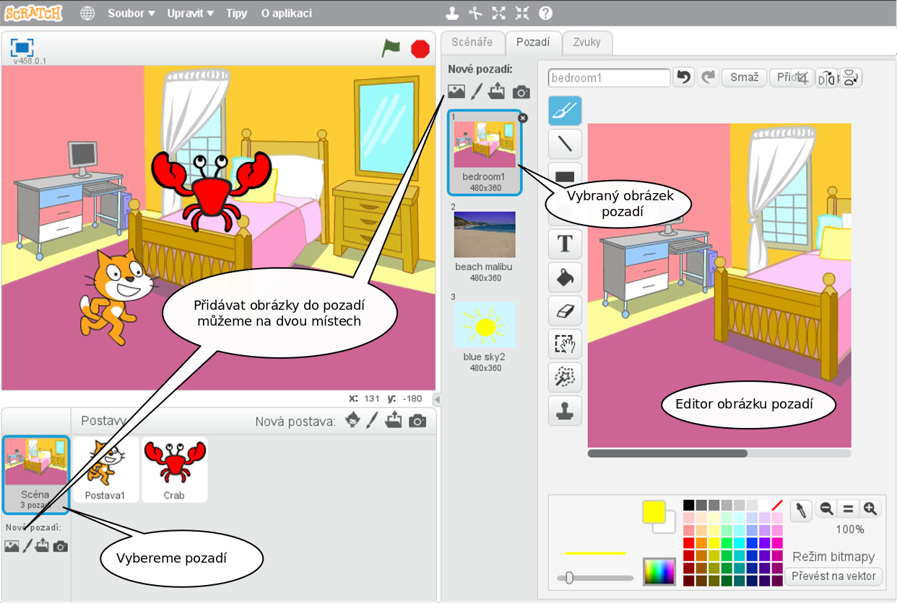
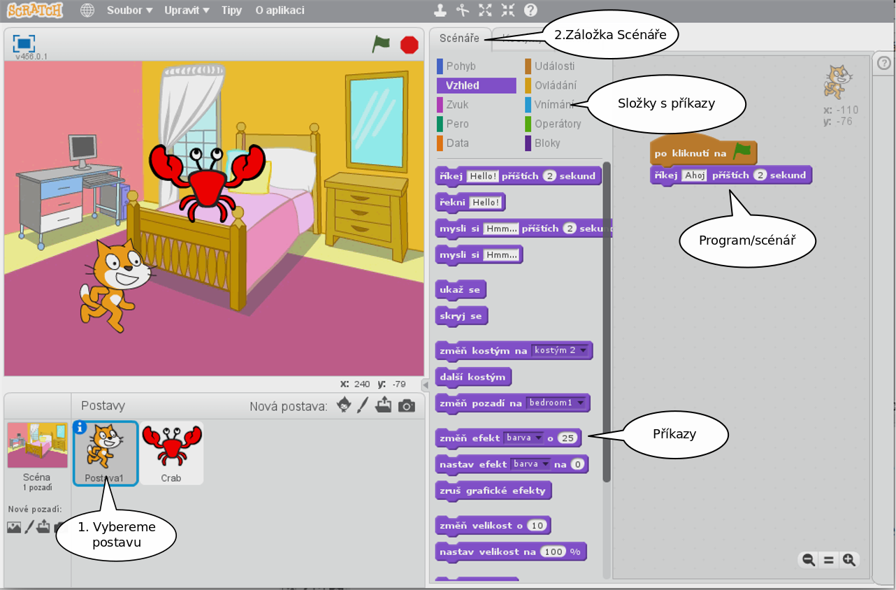
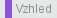
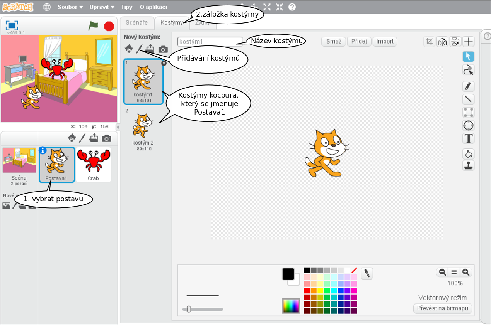
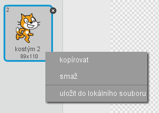
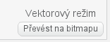
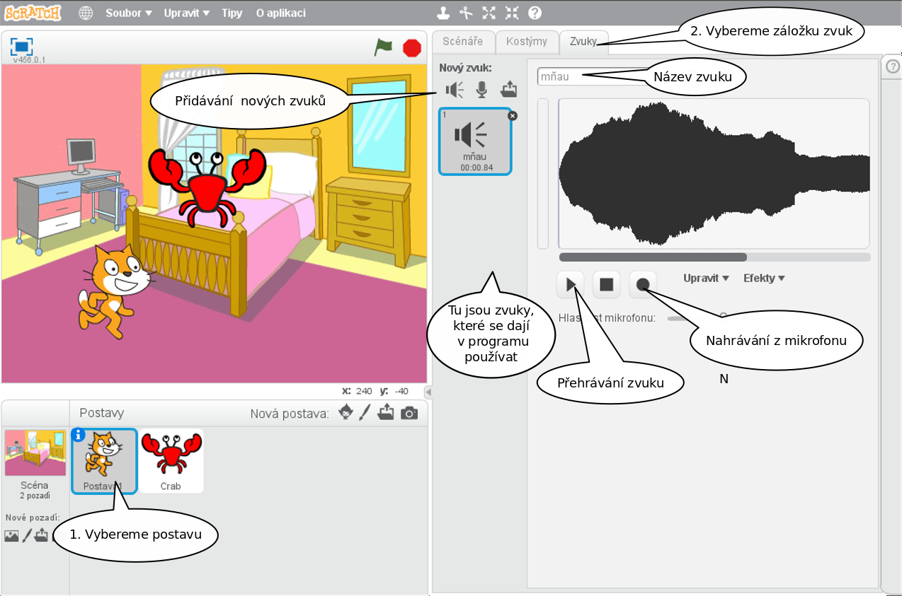
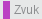

# První program

---
### Co se naučíme:
Úplně první lekce, seznámení se se Scratch editorem.    
Tady byste měli začít, pokud o Scratchi netušíte vůbec nic

* seznámíme se s jednotlivými částmi editoru
* pozadí, postavy,scénáře 
* události <sb>po kliknutí na mě</sb>, <sb>po stisku klávesy [ mezera v]</sb>, <sb>po kliknutí na @greenFlag</sb> 
* kostýmy, zvuky
* ukládání programu, načítání programu

---

## Scratch editor
### Scéna
Po spuštění Scratche se před námi objeví editor rozdělený na několik částí:    
    

Vlevo nahoře je velká bílá plocha, které říkáme *scéna*. Je to prostor, na kterém se odehrává to, co jsme naprogramovali. Po scéně se pohybují postavy z *ohrádky* pod scénou a scéně také lze nastavit pozadí. 

### Pozadí

Obrázek pozadí scény se nastavuje vlevo dole. Vybrat si můžeme z hotových obrázků z knihovny pozadí, nebo si pozadí namalujeme. Je možné si nahrát do pozadí obrázek uložený v počítači, nebo se vyfotit kamerou.    
Nový obrázek se přidává těmito ikonami .    
Obrázků pozadí si můžeme do projektu nahrát několik, zobrazovat se bude vždy ten, který je v záložce *Pozadí* v pravé části editoru vybraný.
  

Pozadí ve Scratchi ale není jen soubor obrázků. Jeho součástí je i **kód (*Scénáře*)**, který určuje jeho chování, a ***zvuky***, které program pozadí může spouštět. Časem se naučíme ovládat pozadí i programem.

<div class="poznamka" markdown="1">
:bulb: **Úkol 1. Vyberte si pěkné pozadí pro naše první pokusy**
</div>

### Postavy
Postavy, které chceme v našem programu "zapojit do hry", musíme nejprve přidat do *ohrádky pro postavy*, která se nachází pod scénou. Postavu si opět můžeme vybrat už hotovou z knihovny, nebo si namalovat vlastní.

<div class="poznamka" markdown="1">
:bulb: **Úkol 2. Přidejte do ohrádky ještě jednu postavu z knihovny postav**
</div>

Stejně, jako je tomu u pozadí, **je součástí postavy** její **vzhled (*Kostýmy*)**, její **kód (*Scénáře*)**, který určuje její chování za běhu programu, a její ***Zvuky***, které lze používat v programu.

### Scénáře

Každé postavě zvlášť, i pozadí, lze naprogramovat, co bude na scéně po spuštění programu dělat. Aby se postava chovala tak, jak chceme, musíme jí to říct jazykem, kterému rozumí.    
Všechny příkazy, které postava zná, najdeme v záložce *Scénáře* uprostřed editoru, roztříděné do složek podle oblastí, kterých se týkají.



 
<div class="poznamka"><b>Poznámka:</b> Stále dokola budu v obrázcích i textu upozorňovat na to, že <b>před tím, než začneme upravovat kód, kostýmy, či zvuky, je třeba vybrat v ohrádce postavu (pozadí), které se to týká</b>. Začátečníkůmu se velmi často stává, že napíší program nebo přidají zvuky do jiné postavy, než zamýšleli.<br/> Až ve vás hrkne, že vám zmizel program, zkontrolujte nejdřív, že se nacházíte v postavě, ve které jste ho psali.
</div>

Příkazy ze složek vybíráme myší a přetahujeme na plochu vpravo. Řadíme je za sebe v pořadí, ve kterém chceme, aby byly vykonávány a spojujeme k sobě jako puzzle.    
Pokud se nám vybraný příkaz nehodí, smažeme ho tak, že ho prostě vrátíme myší zpět do nabídky příkazů.

<div class="poznamka" markdown="1">
:bulb: **Úkol 3. Najděte v nabídce příkazů následující příkazy: <sb>posuň se o (10) kroků</sb>, <sb> říkej [Hello] příštích (2) sekund</sb>, <sb>čekej (1) sekund</sb>,  <sb>skryj se</sb>, <sb>ukaž se</sb>. Příkaz přetáhněte myší do prostoru pro scénáře a dvojklikem na příkaz ho spusťte.
<br/>Zkoušejte spojovat příkazy za sebe a dvojklikem spouštět.**
</div>


<div class="poznamka" markdown="1"><b>Poznámka:</b> Všiměte si, že příkazy mají vždy stejnou barvu, jako složka, ve které se nacházejí. Napoví vám to později, ve které složce máte příkaz, který uvidíte v návodu, hledat.
</div>

### Události
To, kdy bude který příkaz či sekvence příkazů spuštěna řídí *události*. Událostí je třeba spuštění programu, zmáčknutí klávesy, kliknutí myší.. Rozklikněte záložku  a uvidíte, které události Scratch nabízí.

Zatím nám budou bohatě stačit první 3: <sb>po kliknutí na mě</sb>, <sb>po stisku klávesy [ mezera v]</sb>, <sb>po kliknutí na @greenFlag</sb> 

Události mají tvar hnědé čepice, která se z vrchu přilepí k sekvenci příkazů a určí tím, kdy má být vykonávána.

Tento kus kódu říká postavě, že pokaždé, když zmáčkneme mezeru, má se posunout o 10 kroků:

```blocks

po stisku klávesy [ mezera v]
posuň se o (10) kroků
```
### První program

<div class="poznamka" markdown="1" >
:feet: **Krok za krokem**

 <b>Vytvoříme náš první program. Po spuštění nás postavička pozdraví. Bude se pohybovat vpravo/vlevo po stisknutí příslušné klávesy:</b>

 <iframe allowtransparency="true" width="485" height="402" src="//scratch.mit.edu/projects/embed/210821336/?autostart=false" frameborder="0" allowfullscreen></iframe>

 [Program na stránkách scratch.mit.edu](https://scratch.mit.edu/projects/210821336)

Z minulých úkolů už máme nastavené krásné pozadí a dvě postavy na scéně. 
#### Pozdrav   
**Vybereme postavu kocoura** a na plochu pro scénáře přetáhneme ze záložky  příkaz <sb> říkej [Hello] příštích (2) sekund</sb>. Příkaz upravíme na <sb> říkej [Ahoj] příštích (5) sekund</sb>.    
Ze záložky  vybereme událost <sb>po kliknutí na @greenFlag</sb> a přilepíme k předchozímu příkazu.    
<code class="language-blocks">
po kliknutí na @greenFlag
říkej [Ahoj] příštích (5) sekund
</code>
A máme kocoura, který nás po spuštění programu vlaječkou pozdraví!

#### Pohyb
Pokud chceme, aby šel kocour doprava, nejprve ho tam musíme nasměrovat přikazem <sb>natoč se směrem (90 v)</sb>. Teprve potom tam kocoura můžeme poslat: <sb>posuň se o (10) kroků</sb>. K tomu všemu přilepíme čepici <sb>po stisku klávesy [ šipka vpravo v]</sb>. 
<code class="language-blocks">
po stisku klávesy [ šipka vpravo v]
natoč se směrem (90 v)
posuň se o (10) kroků
</code>
A Skrečák už se sune doprava.

Stejným způsobem uděláme i pohyb vlevo:
<code class="language-blocks">
po stisku klávesy [ šipka vlevo v]
natoč se směrem (-90 v)
posuň se o (10) kroků
</code>
Program vyzkoušejte. Zmáčkněte zelenou vlajku a zkoušejte mačkat klávesy šipka vpravo a vlevo.    
Program vypadá vcelku slušně, jedinou vadou na kráse je, že doleva nám kocour běhá jaksi po hlavě..

Každé postavě můžeme nastavit způsob, jakým se má otáčet. Dokola jako korouhvička, jen doprava/doleva a nebo vůbec. Správné otáčení Skrečáka nám zajistí příkaz <sb>nastav způsob otáčení na[jen vlevo-vpravo v]</sb>. Příkaz přidáme do události <sb>po kliknutí na @greenFlag</sb>, aby se postavě nastavila tato vlastnost hned po startu programu. 
<code class="language-blocks">
po kliknutí na @greenFlag
nastav způsob otáčení na[jen vlevo-vpravo v]
říkej [Ahoj] příštích (5) sekund
</code>  
Až spustíte program vlajkou příště, kocour už se bude chovat tak, jak má. 
</div>

    
### Kostýmy

Každá postava může mít libovolné množství kostýmů, do kterých se může "převlékat". To jaký má postava vzhled určuje vybraný kostým. Abychom se mohli podívat na kostýmy postavy, **vybereme postavu, jejíž kostýmy chceme vidět** a vybereme záložku *Kostýmy* v pravé půlce editoru. V pravé část editoru se zobrazí vše, co je třeba k editaci kostýmů.



Z obrázku vidíme, že kocour Skrečák má kostýmy dva.

Když bychom kocourovi smazali všechny jeho kostýmy a nahráli mu kostýmy třeba baletky, bude jednoduše vypadat v našem programu jako baletka, ale chovat se bude dál tak,jak jsme ho naprogramovali předtím.

Kostýmy se mažou a kopírují po stisknutí pravého tlačítka myši nad kostýmem.



<div class="poznamka" markdown="1">
:bulb: **Úkol 4: Smažte jeden kostým kocoura, druhý zkopírujte a kopii dokreslete zavřené oko nebo vyplázlý jazyk** 
</div>
<div class="poznamka" markdown="1">
<b>Poznámka:</b> Pokud by se vám obrázek upravoval špatně, můžete si ho převést z vektorového režimu na bitmapu (vpravo dole): 
</div>

### Mrkací program

<div class="poznamka" markdown="1" >
:feet: **Krok za krokem**

 <b>Chceme, aby naše postava z minulých cvičení zamrkala (nebo vyplázla jazyk), když na ni klikneme myší:</b> 

  <iframe allowtransparency="true" width="485" height="402" src="//scratch.mit.edu/projects/embed/210922318/?autostart=false" frameborder="0" allowfullscreen></iframe>
  
 [Program na stránkách scratch.mit.edu](https://scratch.mit.edu/projects/210922318/)

 Vezmeme projekt, na kterém jsme pracovali v minulých cvičeních a vylepšíme ho o mrkání.

 Událostí, na kterou bude postava nově reagovat je <sb>po kliknutí na mě</sb>. Opět najdeme ve složce .

 Mrkání zařídíme tak, že změníme postavě na chviličku kostým. Místo kostýmu s otevřenýma očima bude mít kostým s okem zavřeným a za moment zas vrátíme kostým původní.

Změnu kostýmu provede příkaz <sb>změň kostým na [ v]</sb>
ze záložky . Z nabídky kostýmů v příkazu vybereme ten se zavřeným okem. Pak musíme chvilku počkat, aby si lidské oko vůbec stihlo všimnout, že se změnil kostým. To zajistí příkaz <sb>čekej () sekund</sb>. Pak postavě vrátíme její původní kostým:
<code class="language-blocks">
po kliknutí na mě
změň kostým na [oko v]
čekej (0.2) sekund
změň kostým na [kostým1 v]
</code>
    
Ještě by to chtělo se ujistit, že program bude startovat s kocourem s oběma očima otevřenýma.    
Upravíme kód v události <sb>po kliknutí na @greenFlag</sb>:
<code class="language-blocks">
po kliknutí na @greenFlag
nastav způsob otáčení na[jen vlevo-vpravo v]
změň kostým na [kostým1 v]
říkej [Ahoj] příštích (5) sekund
</code>  
Program ozkoušejte.
 </div>


### Zvuky
Když budeme chtít, aby naše postavy vydávaly nějaké zvuky, musíme jim nejprve zvuky přidat do jejich záložky zvuků.
*Vybereme postavu, které chceme přidávat zvuky**, a vybereme záložku *Zvuky*. V pravé časti se objeví editor zvuku.



Zvuky opět můžeme, stejně jako kostýmy, přidávat z knihovny hotových zvuků, nebo si můžeme nahrát zvuk vlastní.

<div class="poznamka" markdown="1">
:bulb: **Úkol 5: Přidejte postavě kocoura zvuk, který sami nahrajete** 
</div>

### Program se zvuky

<div class="poznamka" markdown="1" >
:feet: **Krok za krokem**

 <b>Když na kocoura klikneme myší, chceme, při mrknutí vydal nějaký zvuk:</b> 

 <div class="poznamka" markdown="1">
:bulb: **Úkol 4: Smažte jeden kostým kocoura, druhý zkopírujte a kopii dokreslete zavřené oko nebo vyplázlý jazyk** 

<iframe allowtransparency="true" width="485" height="402" src="//scratch.mit.edu/projects/embed/210996855/?autostart=false" frameborder="0" allowfullscreen>
</iframe>
    
[Program na stránkách scratch.mit.edu](https://scratch.mit.edu/projects/210996855/)

Tentokrát bude úprava kódu minulého programu velmi jednoduchá. V záložce  vybereme příkaz <sb>přehraj zvuk [mňau v]</sb> a připojíme ho pod událost 
<sb>po kliknutí na mě</sb>. Upravený kód bude vypadat následovně:

<code class="language-blocks">
po kliknutí na mě
přehraj zvuk [mňau v]
změň kostým na [oko v]
čekej (0.2) sekund
změň kostým na [kostým1 v]
</code>
</div>

<div class="poznamka" markdown="1">
<b>Poznámka:</b> Asi jste si při zkoušení programu všimli, že záložka   nabízí na přehrávání zvuku příkazy dva: <sb>přehraj zvuk [mňau v]</sb> a <sb>hraj zvuk [mňau v] až do konce</sb>. Rozdíl mezi nimi je následující.
<sb>hraj zvuk [mňau v] až do konce</sb>:
Ve chvíli, kdy program doběhne k tomuto příkazu, se spustí přehrávání vybraného zvuku a program pokračuje dalším příkazem až ve chvíli, kdy zvuk dohraje
<sb>přehraj zvuk [mňau v] </sb>:
Program doběhne k tomuto příkazu, spustí přehrávání zvuku,a zatímco zvuk hraje, program pokračuje dal.
</div>

<div class="poznamka" markdown="1">
:bulb: **Úkol 6: Rozhodněte, který z příkazů popsaných v předchozí poznámce použijete,pokud chcete, aby kocour třikrát za sebou zamňoukal**     
Pokud nevíte, zkuste naprogramovat obě varianty.
</div>

<div class="poznamka" markdown="1">
:bulb: **Úkol 7: Rozhodněte, který z příkazů popsaných v předchozí poznámce použijete,pokud chcete, aby kocour zamňoukal a hýbal u toho pusou** 
Pokud nevíte, zkuste naprogramovat obě varianty.
</div>

 