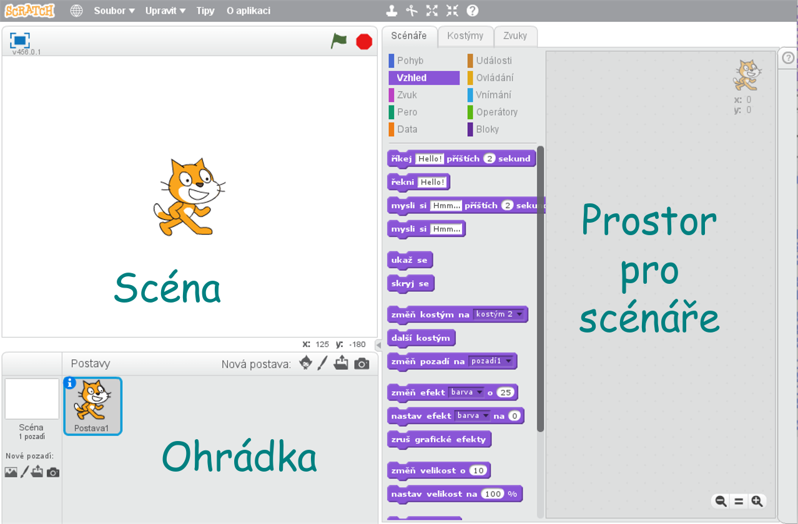

# Pohyb po scéně

---
### Co se naučíme:
Je to úplně první lekce, seznámení se se Scratchem

* seznámíme se s jednotlivými částmi Scratch editoru
* postavy, kostýmy, zvuky
* události <sb>po kliknutí na mě</sb>, <sb>po stisku klávesy [ mezera v]</sb>, <sb>po kliknutí na @greenFlag</sb> 
* ukládání programu, načítání programu

---

## Scratch editor
### Scéna
Po spuštění Scratche se před námi objeví editor rozdělený na několik částí.

Vlevo nahoře je velká bílá plocha, které říkáme *scéna*. Je to prostor, na kterém se odehrává to, co jsme naprogramovali. Po scéně se pohybují postavy z *ohrádky* pod scénou a scéně také lze nastavit pozadí. 

Pozadí se nastavuje vlevo dole. Vybrat si můžeme z hotových obrázků z knihovny pozadí, nebo si pozadí namalujeme. Je možné si nahrát  do pozadí obrázek uložený v počítači, nebo se vyfotit na pozadí kamerou. Nové pozadí se přidává těmito ikonami 

:bulb: Úkol 1. Vyberte si pěkné pozadí pro naše první pokusy

### Postavy
Postavy, které chceme v našem programu "zapojit do hry", musíme nejprve přidat do *ohrádky pro postavy*, která se nachází pod scénou. Postavu si opět můžeme vybrat už hotovou z knihovny, nebo si namalovat vlastní.

:bulb: **Úkol 2. Přidejte do ohrádky ještě jednu postavu z knihovny postav**

#### Scénáře

Každé postavě zvlášť (i pozadí) lze nařídit, co bude na scéně po spuštění programu dělat. Aby se postava chovala tak, jak chceme, musíme jí to říct jazykem, kterému rozumí. Všechny příkazy, které postava zná, najdeme uprostřed Scratch editoru, roztříděné do složek podle oblastí, kterých se týkají.

 **Vybereme postavu, kterou chceme programovat**, vybereme záložku Scénáře.

<b>Poznámka:</b> **Vybereme postavu, kterou chceme programovat** budu stále dokola psát tučným písmem. Jedna z nejčastějších začátečnických chyb je začít psát program do jiné postavy. A až ve vás hrkne, že vám zmizel program, zkontrolujte nejdřív, že se nacházíte v postavě, ve které jste ho psali.

Příkazy ze složek vybíráme myší a přetahujeme na plochu vpravo. Řadíme je za sebe v pořadí, ve kterém chceme, aby byly vykonávány a spojujeme k sobě jako puzzle. 

 Pokud se vám vybraný příkaz nehodí, smažete ho tak, že ho prostě vrátíte myší zpět do nabídky příkazů.

<b>Poznámka:</b> Všiměte si, že příkazy mají vždy stejnou barvu, jako složka, ve které se nacházejí. Napoví vám to později, ve které složce máte příkaz, který uvidíte v návodu, hledat.

V této lekci nám budou stačit příkazy ze složky *Vzhled* a *Události*

>** :feet: Krok za krokem**
> Vytvoříme náš první program.Po spuštění nás postavička pozdraví.

 <iframe allowtransparency="true" width="485" height="402" src="//scratch.mit.edu/projects/embed/210821336/?autostart=false" frameborder="0" allowfullscreen></iframe>

>Z minulých úkolů už máme nastavené krásné pozadí a dvě postavy na scéně.    
>Vybereme postavu kocoura a na plochu pro scénáře přetáhneme ze záložky *vzhled* příkaz <sb> říkej [] příštích () sekund</sb>

A
    
#### Kostýmy

Každá postava může mít libovolné množství kostýmů, do kterých se může "převlékat". To jaký má postava vzhled určuje vybraný kostým. Abychom se mohli podívat na kostýmy postavy, **přesvědčíme se, že máme vybranou postavu, jejíž kostýmy chceme vidět** a vybereme záložku *Kostýmy* v pravé půlce editoru. Pravá šást editoru se překreslí a zobrazí se nám vše,co je třeba k editaci kostýmů.

Jak je vidět, kocour Skrečák má například kostýmy dva. Když bychom kocourovi smazali všechny jeho kostýmy a nahráli mu kostýmy třeba baletky, bude jednoduše vypadat v našem programu jako baletka.

Kostýmy se mažou a kopírují po stisknutí pravého tlačítka myši nad kostýmem.

>**:bulb: Úkol 3. Smažte jeden kostým kocoura, druhý zkopírujte a kopii domalujte vypláznutý jazyk.** 
>> Pokud by se vám obrázek upravoval špatně, můžete si ho převést z vektorového režimu na bitmapu (vpravo dole): 

#### Zvuky
Když budeme chtít, aby naše postavy vydávaly nějaké zvuky, musíme jim nejprve zvuky přidat do jejich záložky zvuků.
**Přesvědčíme se, že máme vybranou postavu, které chceme přidávat zvuky**, a vybereme záložku *Zvuky*. Pravá část se překreslí a zobrazí se editor zvuků.

Zvuky opět můžeme, stejně jako kostýmy, přidávat z knihovny hotových zvuků, nebo si můžeme nahrát zvuk vlastní.

