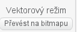

# Pohyb po scéně

---
### Co se naučíme:
Je to úplně první lekce, seznámení se se Scratchem

* seznámíme se s jednotlivými částmi Scratch editoru
* postavy, kostýmy, zvuky
* události <sb>po kliknutí na mě</sb>, <sb>po stisku klávesy [ mezera v]</sb>, <sb>po kliknutí na @greenFlag</sb> 
* ukládání programu, načítání programu
---
## Scratch editor
Po spuštění Scratche se před námi objeví editor rozdělený  na 4 části.

Vlevo nahoře je velká bílá plocha, které říkáme *scéna*. Je to prostor, na kterém se odehrává to, co jsme naprogramovali. Po scéně se pohybují postavy z ohrádky pod scénou a scéně také můžeme nastavit pozadí. 

Pozadí se nastavuje vlevo dole. Vybrat si můžeme z hotových obrázků z galerie, nebo můžeme pozadí namalovat, nahrát si do pozadí obrázek uložený v počítači, nebo se vyfotit na pozadí kamerou. 

>**:bulb: Úkol 1. Vyberte si pěkné pozadí pro naše první pokusy** 

Postavy, které chceme v našem programu "zapojit do hry" musíme nejprve přidat do *ohrádky pro postavy*, která se nachází pod scénou. Postavu si opět můžeme vybrat už hotovou, nebo si namalovat vlastní.

>**:bulb: Úkol 2. Přidejte do ohrádky ještě jednu postavu**

Každá postava může mít libovolné množství kostýmů, do kterých se může převlékat. To jaký má postava vzhled určuje právě kostým. Abychom se mohli podívat na kostýmy postavy, **přesvědčíme se, že máme vybranou postavu, jejíž kostýmy chceme vidět** a vybereme záložku *Kostýmy*. 

Jak je vidět,kocour Scratchák má například kostýmy dva. Když bychom kocourovi smazali všechny jeho kostýmy a nahráli mu kostýmy třeba baletky, bude jednoduše vypadat jako baletka.

Kostýmy se mažou a kopírují po stisknutí pravého tlačítka myši nad kostýmem.

>**:bulb: Úkol 3. Smažte jeden kostým kocoura, druhý zkopírujte a kopii domalujte vypláznutý jazyk.** 
>> Pokud by se vám obrázek upravoval špatně, můžete si ho převést z vektorového režimu na bitmapu (vpravo dole): 

